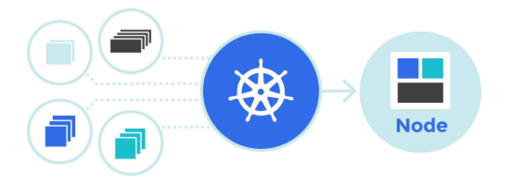

Glossary:

- Ops (Operation): Automating the process of building and deploying applications
- Kubernetes: An open-source multi-server setup developed by Google
- Docker: A container platform which helps running application with different environments with ease.
- VM: Virtual Machine

Until last week I have no idea what Kubernetes is and how Docker works. However,
in my workplace, I was then given an opportunity to do research on understanding
them. I was also expected to try to make a similar multi-server setup with a new
service, just like how we were aided by an ops guy in a consultant company we
worked with. It was daunting and scary for me, like walking to an unknown dark
forest :p. However, 5 days later I acquired a decent amount of knowledge in
this field and even managed to deploy a Kubernetes cluster on the Google Cloud
Platform. This series will be my own personal journal describing in my own words
what I learned,
did and experimented.

My sense of curiosity encouraged me to take the task and what I did first was to
fire up the website of [Kubernetes](https://kubernetes.io), follow their quick
start to deploy a hello-world nodejs application to a virtual Kubernetes
cluster. From the tutorial, I learned that Kubernetes is also what Google is
using to deploy their huge server network which serves billions of request each
day. Kubernetes is "Planet-scale, Never outgrow the needs and Run Anywhere". Kubernetes has extensive and comprehensive documentation, a huge community to
support when having a problem and support from all big cloud computing service
like Google with Google Cloud Platform, Amazon AWS, and Microsoft Azure. With that in mind, I was given more motivation for learning to use this tool. So what is Kubernetes trying to solve?

For every Internet service, there are many ways to scale the server when there
is a demand to serve more traffic:

> 1. Upgrade the server itself,
> 2. Optimize the back-end code.
> 3. Make multiple copies of a server and serve them

With the solution 3, we can have the advantage of having more uptime even when
updating the server code to a new version since we can, for example, roll out an update on the first half of the number of servers, and when they are ready we
can update the rest. Using a multi-server setup also mitigate the issue when a
server is having a failure since others can take the request instead. The
problem is, how can we manage the network with ease, less manual and robust way?
The problem can be listed as below:

> 1. How can we manage the traffic to be fair and equal to each of your servers?
> 2. If a server is failing, how can we be notified and "rescue" that server?
> 3. If an update is making some serious bugs and you already deployed to all server, rolling back will be a pain :(

The list can be longer but that was what I realized. Kubernetes is developed to solve those issues. It is a server network consists
of multiple computers (they can be real physical computers or VM ones). One of
them is the Kubernetes master, and others are called `nodes`. The master is
responsible for managing the application deployment, versioning to the nodes. We
the developers will also interact with the master and not the nodes directly
through a set of API provided by the Kubernetes framework. Those APIs can be used
and accessed using the command-line interface `kubectl`. This cli allow you to
send commands to the Kubernetes master by a set of verbs and object such as:

```bash
# This command will create a new namespace on the network
kubectl create namespace my-new-namespace

# You can create other objects than namespace such as secret
kubectl create secret generic your-secret-name username password

# This command will delete a namespace
kubectl delete namespace my-new-namespace

# This command will delete a service
kubectl delete service your-service
```

or you can make a `yaml` file to describe what you want to create as some object
can be complex to be described in a command. For example:

```yaml
# This yaml describes a Service that will expose your "MyApp"
# to port 80 through TCP Protocol, the incoming requests
# are mapped to port 9376 of the real backend service "My App"
kind: Service
apiVersion: v1
metadata:
  name: my-service
spec:
  selector:
    app: MyApp
  ports:
    - protocol: TCP
      port: 80
      targetPort: 9376
```

Your application, or back-end code, with other services, will be deployed, run and managed as Docker containers split equally into the nodes by the master. Therefore we need to know Docker to use Kubernetes. This will be the next part of this series. I hope you enjoyed reading my learning journey :D.

Happy deploying!
